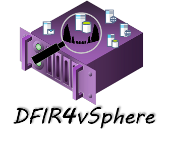

---

## Table of contents:

1. [Module description](#description)
2. [Installation and pre-requisites](#install)
3. [Start-VC_Investigation data collection](#Start-VC_Investigation)
4. [Start-ESXi_Investigation data collection](#Start-ESXi_Investigation)
5. [Files generated](#Files)
6. [Logs analysis with Splunk](#Logs)

# Module description: <a name="description"></a>

The DFIR4vSphere PowerShell module collects logs and forensics artefacts on both ESXi hosts and the VCenter console. 

The module has two main functions:

* Start-VC_Investigation: This function will collect all vSphere API calls registered on the VCenter, these logs are called VI events. You can also collect only events considered of interest. ESXi inventory, VCenter permissions and users report is also generated by the function. Optionally, a support bundle for the VCenter appliance can be generated.
* Start-ESXi_Investigation: Collects forensics data on a single or multiple ESXi hosts. Optionally, a support bundle for each hypervisor targeted can be generated.

# Installation and pre-requisites: <a name="install"></a>

DFIR4vSphere uses the VMWare PowerCLI module, please install it before using the module:

```
 Install-Module VMware.PowerCLI -Scope CurrentUser 
```

Once installed locate your PowerShell modules path with the following command:

```
PS> $env:PSModulePath
```
Copy the DFIR4vSphere folder in one of the modules path, for example:
```
    %USERPROFILE%\Documents\WindowsPowerShell\Modules
    %ProgramFiles%\WindowsPowerShell\Modules
    %SYSTEMROOT%\system32\WindowsPowerShell\v1.0\Modules
```
The DFIR4vSphere module is installed, restart the PowerShell console and load the module:
```
PS> Import-module DFIR4vSphere
```

You should then connect to the VCenter you are investigating **before** launching the data collection:

```
PS> Connect-VIServer %VC_Name%
```

# Start-VC_Investigation data collection: <a name="Start-VC_Investigation"></a>

Collect VCenter VI events for the last 30 days:

```
$enddate = get-date
$startdate = $enddate.adddays(-30)
Start-VC_Investigation -StartDate $startdate -Enddate $enddate
```

Perform the same collection with the VCenter support bundle, do this in case you suspect a compromise on the VCenter appliance itself, in that case you should also perform a classic linux forensics investigation on the VCenter host:

```
$enddate = get-date
$startdate = $enddate.adddays(-30)
Start-VC_Investigation -StartDate $startdate -Enddate $enddate -VCBundle
```

The *LightVIEvents* parameter, will collect only event types considered of interest. Use this option if the infrastructure beeing investigated is large and normal collection is too slow.

```
$enddate = get-date
$startdate = $enddate.adddays(-30)
Start-VC_Investigation -StartDate $startdate -Enddate $enddate -LightVIEvents
```

With the *LightVIEventTypesId* you can filter out what specific event types you would like to collect. A complete list of Event type IDs is [available here](https://github.com/lamw/vcenter-event-mapping). For example to retrieve only authentication events on the VCenter you can launch the following command:

```
$enddate = get-date
$startdate = $enddate.adddays(-30)
Start-VC_Investigation -StartDate $startdate -Enddate $enddate -LightVIEvents -LightVIEventTypesId "com.vmware.sso.LoginSuccess","com.vmware.sso.LoginFailure"
```

Default log retention for VI Events is 30 days, but you can try to retrieve older events. Sometimes logs are retrieved beyond configured retention strategy.

# Start-ESXi_Investigation data collection: <a name="Start-ESXi_Investigation"></a>

This command will take as input an ESXi host by its name or retrieved with the *Get-VMHost* PowerCLI cmdlet. For example to perform a basic collection on all ESXi hosts attached to the VCenter:

```
Get-VMHost | Start-ESXi_Investigation
```

The above command will generate serveral CSV files describing running processes, open connections, local accounts and retrieve various configuration settings...

If you also need to retrieve local logs of the ESXi (such as *shell.log* or *auth.log*) you will need to generate a support bundle.

The below command retrieves every ESXi for a given cluster and generates for each hypervisor a support bundle.

```
Get-VMHost -Location %ClusterName% | Start-ESXi_Investigation -ESXBundle
```

You can also target a particular ESXi host and generate its support bundle by giving its name.

```
Start-ESXi_Investigation -Name %ESXi% -ESXBundle
```
Generating support bundles for every ESXi attached to a VCenter might take some time in large environments.

# Files generated: <a name="Files"></a>


The files generated by each function are:

- Start-VC_Investigation: A log and four CSV files are created in the root folder. VI Events are located in the *VI_Events_%VC_Name%* directory, if you collect all events they are a stored in a folder for each day, if you use the *LightVIEvents* parameter they are stored in a file by event type. Optionally if the *VCBundle* parameter is enabled, a *tgz* archive is generated in the *Support_Bundles* directory.
- Start-ESXi_Investigation: A log is generated in the root folder. For each hypervisor investigated a folder *%ESX_Name%* is created, in that folder several CSV files are generated: Running processes, services, open connections are collected...  Optionally if the *ESXBundle* parameter is enabled, a *tgz* archive is generated in the *Support_Bundles* directory.

Launching the various functions will generate a similar directory structure:

```
DFIR4vSphere_Collection
│   Start-ESXi_Investigation.log
│   Start-VC_Investigation.log
│   VC_ConnectionInfo_%VC_Name%.csv
|   VC_ESXiInventory_%VC_Name%.csv
│   VC_Permissions_%VC_Name%.csv
│   VC_Users_%VC_Name%.csv    
└───%ESX_Name1%
│    │   ESXi_%ESX_Name1%_DomJoin.csv
│    │   ESXi_%ESX_Name1%_General.csv
│    │   ESXi_%ESX_Name1%_Hostd.log
│    │   ESXi_%ESX_Name1%_Network_ARPCache.csv
│    │   ESXi_%ESX_Name1%_Network_DNS.csv
│    │   ESXi_%ESX_Name1%_Network_IPv4.csv
│    │   ESXi_%ESX_Name1%_Network_IPv4routes.csv
│    │   ESXi_%ESX_Name1%_Network_Netstat.csv
│    │   ESXi_%ESX_Name1%_Network_VMs.csv
│    │   ESXi_%ESX_Name1%_Network_vSwitchs.csv
│    │   ESXi_%ESX_Name1%_Services.csv
│    │   ESXi_%ESX_Name1%_Software_BaseImage.csv
│    │   ESXi_%ESX_Name1%_Software_Profile.csv
│    │   ESXi_%ESX_Name1%_Software_VIB.csv
│    │   ESXi_%ESX_Name1%_Storage_FileSystem.csv
│    │   ESXi_%ESX_Name1%_Storage_IOFilter.csv
│    │   ESXi_%ESX_Name1%_System_Accounts.csv
│    │   ESXi_%ESX_Name1%_System_Advanced-delta.csv
│    │   ESXi_%ESX_Name1%_System_Certstore.csv
│    │   ESXi_%ESX_Name1%_System_ExecPolicy.csv
│    │   ESXi_%ESX_Name1%_System_GuestRepo.csv
│    │   ESXi_%ESX_Name1%_System_modules.csv
│    │   ESXi_%ESX_Name1%_System_Kernel-Delta.csv
│    │   ESXi_%ESX_Name1%_System_permissions.csv
│    │   ESXi_%ESX_Name1%_System_process.csv
│    │   ESXi_%ESX_Name1%_System_version.csv
└───%ESX_Name2%
│    │   ESXi_%ESX_Name2%_DomJoin.csv
│    │   ESXi_%ESX_Name2%_General.csv
│    │   ...
└───Support_Bundles
│    │   esx-%ESX_Name1%-YYY-MM-DD.tgz
│    │   esx-%ESX_Name2%-YYY-MM-DD.tgz
│    │   vcsupport-%GUID%.tgz
└───VI_Events_%VC_Name%
│    │   VIEvents_%EventTypeId1%.json
│    │   VIEvents_%EventTypeId2%.json
│    │   ...
│    └───YYYY-MM-DD
│    |   │   VIEvents_YYYY-MM-DD_HH-00-00.json
│    |   │   ...
│    └───YYYY-MM-DD
│    │   │   VIEvents_YYYY-MM-DD_HH-00-00.json
│    │   │   ...
│    └───...
```


# Logs analysis with Splunk: <a name="Logs"></a>

Once the collection is complete with both functions, you will get logs from:

- Start-VC_Investigation: VI Events collected are in JSON format and can be easily indexed in Splunk by using the *CreatedTime* JSON field as timestamp.
- Start-ESXi_Investigation: ESXi local logs retrieved in the support bundles and located in the */var/run/log* directory can also be indexed by using source types available in the [Splunk addon for ESXi](https://splunkbase.splunk.com/app/5603/).
